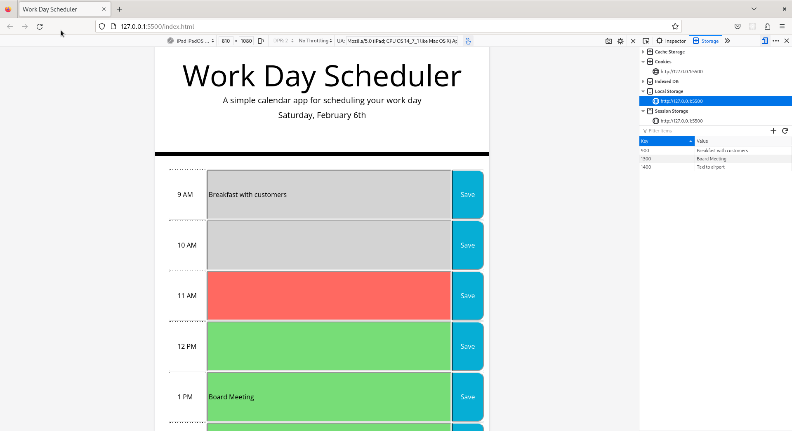

# Module 5: Third-Party APIs Challenge - Work Day Scheduler

## Description

This application is a simple calendar that allows a user to save events for each hour of the day. This app runs in the browser and features dynamically updated HTML and CSS powered by jQuery.

## Installation

The project has already been deployed. Visit: [Work Day Scheduler](https://mbenitez1607.github.io/module5-challenge/)

## Usage
 
On opening the planner the current day is displayed at the top of the calendar.

When scrolling down, you will be presented with time blocks for standard business hours (9am - 5pm). Each time block is color-coded to indicate whether it is in the past, present, or future.

When clicking on a time block allows you to enter an event. For the event to persist, click the `Save` button for that time block.

The text for that event is saved in local storage, so when the page is refreshed, the saved events persist.

Click on the image below to watch a brief video of the Work Day Scheduler in action

## Credits

N/A

## License

MIT